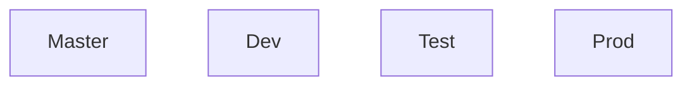

# Prelude

This repository will generate python project templates.

## Goals
- Devcontainer configured
- Dagger CI/CD workflow
- Prod/Test/Dev containers

```mermaid
flowchart TD
    master["Master"]

    dev["Dev"]
    test["Test"]
    prod["Prod"]

```